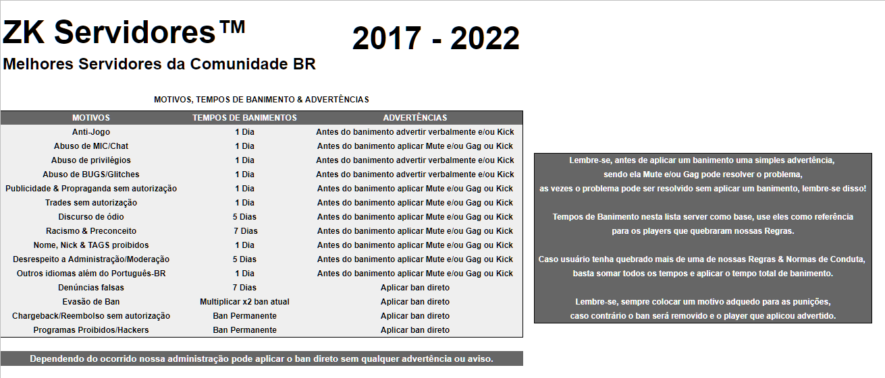

# Jogo fecha sozinho ao tentar me conectar no servidor

Isso pode ser que seu mapa, o mesmo que esta tentando se conectar no servidor esteja corrompido, quebrado. Para resolver precisamos deletar o mapa e verificar a integridade do game, vamos lá.

Primeiro vai na pasta do seu CSGO, para isso basta seguir estas etapas:

* Localize o **Counter-Strike: Global Offensive** em sua steam;
* Com botão direto do Mouse clique em **Propriedades**;

* Feito isso vai abrir outra janela, basta ir em **Arquivos locais** e depois **Navegar pelos Arquivos Locais**;

* Feito isso, entre na pasta CSGO e delete as seguintes pastas lá dentro:
  * **maps**
  * **materials**
  * **models**
  * **resource**
  * **sound**

* Depois basta clicar para **Verificar a Integridade dos Arquivos** do seu game na Steam novamente;

Depois que finalizado basta iniciar o CSGO e depois se conectar em nossos servidores, um novo download será feito dos arquivos que usamos, todos recentes.

Tendo qualquer dúvida, problema não hesite em nos contatar!

